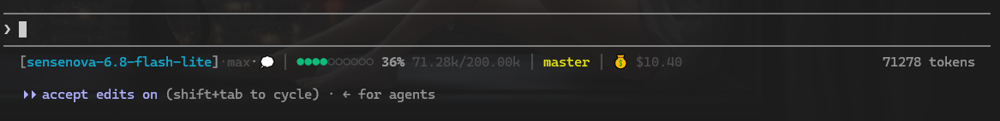

# Claude Code Status Line

自定义 Claude Code 状态栏脚本，从 stdin 读取 JSON，输出一行状态信息。

## 效果

```plaintext
[glm-5.2·high·💭] │ ●●●○○○○○○○ 37% 63.00k/200.00k │ ⚡ researcher │ main │ 💰 $0.00
```



|    字段    |    说明    |
| :--------: | :--------: |
| 模型 | 模型名 · effort 级别 · 思考状态 |
| 上下文用量 | 进度条 + 百分比 + `已用/窗口大小` |
| 当前代理 | 正在执行的子代理名称<br>（仅当子代理运行时显示） |
| Git 分支 | 青色：工作区干净<br>黄色：有未提交改动 |
| 花费 | 当前会话累计消费 |

**进度条颜色说明**

- 🟢 绿色：用量 < 50%
- 🟡 黄色：50% ~ 80%
- 🔴 红色：> 80%

## 安装

> 仅需 Python 标准库，无第三方依赖。

**快捷安装**

直接运行脚本进行配置：
~~~python
python3 install.py
~~~

**手动安装**

配置 `~/.claude/settings.json`，加入以下内容：

```json
{
  "statusLine": {
    "type": "command",
    "command": "python3 /path/to/statusline/statusline.py",
    "padding": 0,
    "refreshInterval": 1
  },
  "verbose": true
}
```
